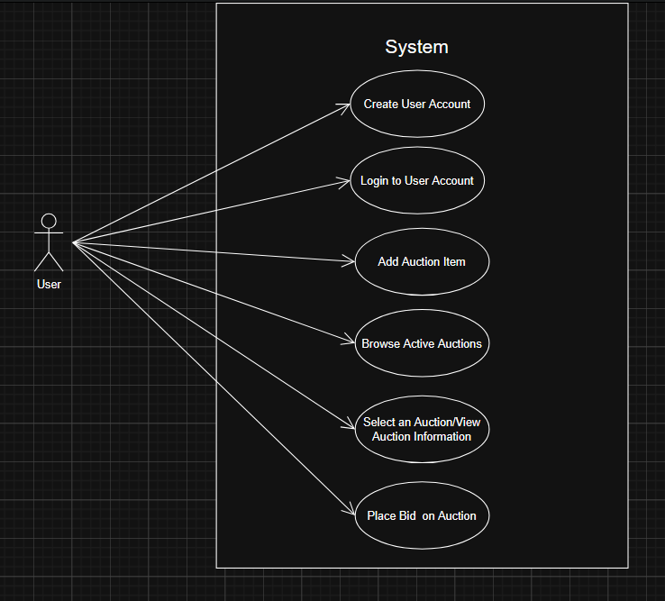
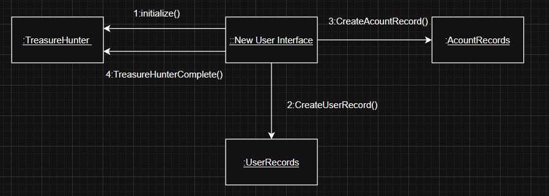
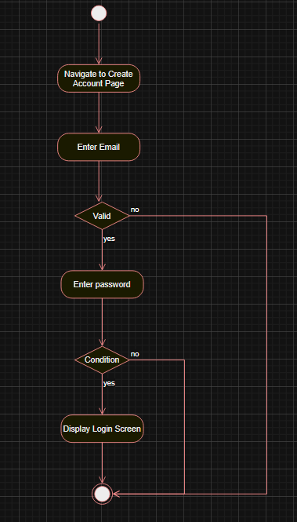
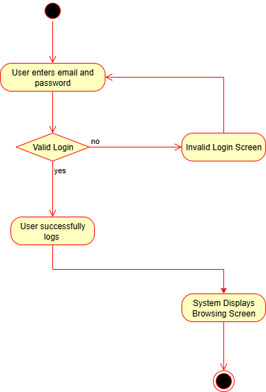
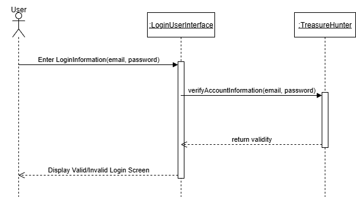
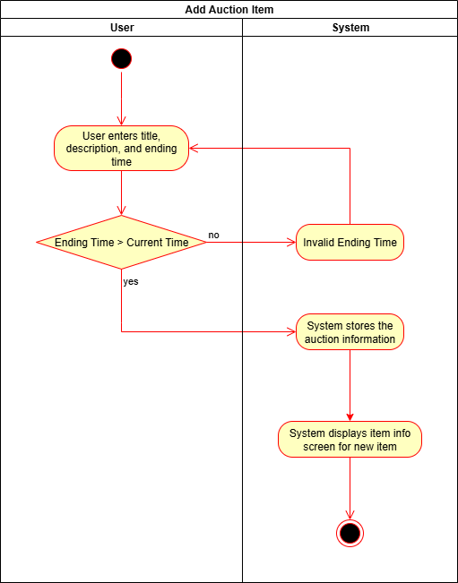
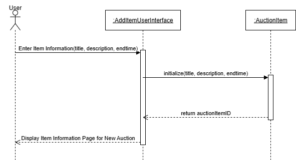

# UD Treasure Trove
Repository for the UD Treasure Trove project for 2025

Jira Board For the Project:
https://cps-490-ud-treasure-trove.atlassian.net/jira/core/projects/TT/board 

## Introduction

### Purpose
This project aims to create a system for holding and participating in auctions for items that are put up for auction by users.

### Scope
This document covers the requirements and use cases for the project, and aims to define our user requirements so that we can implement the system following these requirements.

### Definitions & Acronyms
* PaaS - Platform as a Service
* Auctioneer - User who puts an item up for auction
* Bidder - User who places bids on an item up for auction

### References
Fill as necessary, remove if empty before submitting. This is for this document.

### Overview
The [Overall Description](#overall-description) section will provide a more in depth look into the requirements and environment of the document. The [Product Perspective](#product-perspective) subsection covers the environment the system will operate within, as well as hardware and software systems it will interface with. The features provided by the software can be found in the [Product Functions](#product-functions) subsection, and a description of our users can be found in the [User Characteristics](#user-characteristics) subsection. Details about the [Constraints](#constraints) or [Assumptions](#assumptions) can be found in the appropriate subsections of the Overall Descripton section.

The Systems Analysis section contains the Data Flow and Entity relationship diagrams. It also contains the use cases, their descriptions, and all diagrams associated with them.

## Overall Description

### Product Perspective
This system will use the MERN stack with MangoDB, ExpressJS, React, and NodeJS. The project will use the Heroku PaaS to build and run the web application.

### Product Functions
The software will provide the following features:
* Creating and logging into user accounts.
* Adding auction items with a descrition, title, and ending time for the auction.
* Browsing through all active auctions.
* Selecting an auction to view it's decription, title, and a countdown to the auction ending time, and a bid history.
* Bidding with tokens on each auction.

### User Characteristics
The users that will interact with this software will fall into one or both of the categories of auctioneer or bidder, as defined in the [Definitions and Acronyms](#definitions--acronyms) section. 

## Systems Analysis

### Context Level Data Flow Diagram

### Context Level Entity Relationship Diagram

### Use Cases

#### Create User Account

#### Description

User enters new account data, and the system
assigns a new account number, creates a new user record, and a new account record

#### Communication Diagram

#### Activity Diagrams

#### Login to User Account

#### Use Case Description

User enters username and password, system validates username and password, system redirects user to the browsing page.

#### Activity Diagram

#### Sequence Diagram

#### Add Auction Item

#### Use Case Description

User selects the add item button, user enters the title, description, and end time of the auction, system adds auction to database to display to other users and presents the auction information screen.

#### Activity Diagram

#### Sequence Diagram

#### Browse Active Auctions

#### Scenario

#### Diagram(s)

#### Select an Auction/View Auction Information

#### Scenario

#### Diagram(s)

#### Place Bid on Auction

#### Scenario

#### Diagram(s)